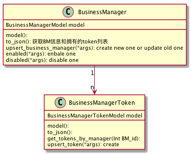

### *Business Manager*

#### 获取 business manager 列表

```http
GET /business_managers
```

请求参数:

| Name      | Type   | Required | Default Value | Description  |
| --------- | ------ | -------- | ------------- | ------------ |
| filter_by | string | no       |               | 筛选         |
| order_by  | string | no       |               | 排序规则     |
| page      | int    | no       |               | 第几页       |
| per_page  | int    | no       | 10            | 每页几个item |

Response: 

```json
Status: 200
{
     business_managers: [{
         business_manager_id: integer,
         media_manager_name: string,
         media_manager_id: string,
         media: string,
         token_count: int,
         agency_type: string,
         status: integer,
     }],
    total: integer,
}
```

#### 添加新的 business manager

```http
POST /business_managers
```

Business Manager 表单

| Field              | type   | required | description                    |
| ------------------ | ------ | -------- | ------------------------------ |
| media              | string | yes      | e.g: facebook, adwords         |
| media_manager_name | string | yes      | business manager name in Media |
| media_manager_id   | string | yes      | business manager id in Media   |
| agency_type        | string | yes      | opua or outsource              |

Response:

```json
Status: 200
{
    business_manager_id: integer
}
```

#### 获取business manager

```http
GET /business_manager/<business_manager_id>
```

Response:

```json
Status: 200
{
    business_manager_id: integer,
    media_manager_name: string,
    media_manager_id: string,
    media: string,
    token_count: int,
    agency_type: string,
    status: boolean,
}
```


#### 编辑business  manager

```http
PUT /business_manager/<business_manager_id>
```

Business Manager 表单:

| Field              | type   | required | description                      |
| ------------------ | ------ | -------- | -------------------------------- |
| media              | string | yes      | 不许修改, e.g: facebook, adwords |
| media_manager_name | string | yes      | business manager name in Media   |
| media_manager_id   | string | yes      | business manager id in Media     |
| agency_type        | string | yes      | 不许修改, opua or outsource      |

Response: 

```json
Status: 200
''
```

#### 激活business manager

```http
PUT /business_manager/<business_manager_id>/enabled
```

Response:

```json
Status: 200
''
```

#### 注销business manager

```http
PUT /business_manager/<business_manager_id>/disabled
```

Response:

```json
Status: 200
''
```

### *Business Manager Token*

#### 获取business manager下面的tokens

```http
GET /business_manager/<business_manager_id>/tokens
```

Response:

```json
Status: 200
{tokens: [
    {
        business_manager_id: integer,
        business_manager_token_id: integer,
        system_user_name: string,
        system_user_id: string,
        token_info: string,
        tags: list of strings,
        detail: string,
        status: integer,
    }, {}, {}, ...
]}
```

#### 新增business manager的token

```http
POST /business_manager/<business_manager_id>/tokens
```

Business Manager Token表单:

| Field            | type    | required | description                            |
| ---------------- | ------- | -------- | -------------------------------------- |
| system_user_name | string  | yes      | name of system user who owns the token |
| system_user_id   | string  | yes      | id of system user who owns the token   |
| token_info       | string  | no       | token信息, 可换行                      |
| tags             | string  | no       | 标签列表                               |
| detail           | string  | no       | 详情, 可换行                           |
| status           | integer | yes      | 激活: 1, 注销: 2                       |

Response:

```json
Status: 200
{
    business_manager_id: integer
}
```

#### 获取business manager的一个token

```http
GET /business_manager/<business_manager_id>/tokens/<token_id>
```

Response:

```json
Status: 200
{
    business_manager_id: integer,
    business_manager_token_id: integer,
    system_user_name: string,
    system_user_id: string,
    token_info: string,
    tags: list of strings,
    detail: string,
    status: integer,
}
```

#### 修改business manager的token信息

```http
PUT /business_manager/<business_manager_id>/tokens/<token_id>
```

Business Manager Token表单:

| Field            | type           | required | description                            |
| ---------------- | -------------- | -------- | -------------------------------------- |
| system_user_name | string         | yes      | name of system user who owns the token |
| system_user_id   | string         | yes      | id of system user who owns the token   |
| token_info       | string         | no       | token信息, 可换行                      |
| tags             | list of string | no       | 标签列表                               |
| detail           | string         | no       | 详情, 可换行                           |
| status           | integer        | yes      | 激活: 1, 注销: 2                       |

Response:

```json
Status: 200
''
```

### Models

#### BusinessManagerModel

| Field               | Type        | description                              | nullable | default | index |
| ------------------- | ----------- | ---------------------------------------- | -------- | ------- | ----- |
| business_manager_id | integer     | 唯一ID标识                               | no       |         | yes   |
| media_manager_id    | varchar(32) | 在media中的ID                            | no       |         | yes   |
| media_manager_name  | varchar(32) | 在media中的名称                          | no       |         | yes   |
| media               | varchar(32) | e.g: facebook, adword                    | no       |         | yes   |
| agency_type         | varchar(32) | opua / outsource                         | no       |         | yes   |
| account_info        | json        | 从ssm导入的数据, 或者{account_id: XXXXX} | no       | []      | no    |
| status              | integer     | 激活: 1; 注销: 2                         | no       |         | yes   |
| created             | datetime    |                                          | no       |         | yes   |
| updated             | datetime    |                                          | no       |         | yes   |

#### BusinessManagerTokenModel

| Field                     | type        | description      | nullable | default | index |
| ------------------------- | ----------- | ---------------- | -------- | ------- | ----- |
| business_manager_token_id | integer     | 唯一ID标识       | no       |         | yes   |
| business_manager_id       | integer     | 上面model的id    | no       |         | yes   |
| system_user_name          | varchar(32) | 系统用户的名称   | no       |         | yes   |
| system_user_id            | varchar(64) | 系统用户的ID     | no       |         | yes   |
| token_info                | text(512)   | 描述             | yes      | null    | no    |
| tags                      | json        | 标签列表         | yes      | []      | no    |
| detail                    | text(512)   | 描述             | yes      | null    | no    |
| status                    | integer     | 激活: 1; 注销: 2 | no       |         | yes   |
| created                   | datetime    |                  | no       |         | yes   |
| updated                   | datetime    |                  | no       |         | yes   |

### Class Diagram



